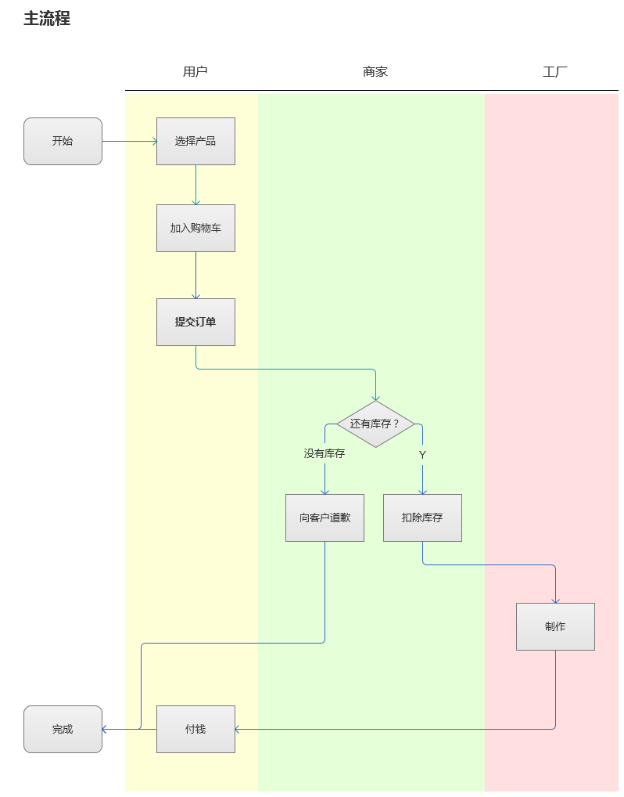

下面所示的代码将会形成如图所示的效果

```
title: 主流程 
roles: 
 cus 用户 
 fac 工厂
 m 商家
start 
@cus 
: 选择产品 
: 加入购物车 
: 提交订单 
@m
if: 还有库存？
 -Y 
 : 确认订单
 : 扣除库存
 @fac
 : 制作
 @m
 : 付钱
 -没有库存 
 : 向客户道歉
end
```



好吧，我还是注释一下吧：

```
# 这是注释
title: 主流程 # 将会显示成标题
roles: # 角色列表，下面的要空一行
 cus 客户 #代号，空格，名称，名称中不许再有空格。代号可以写的很短
 fac # 只写一个的话，就用这个代号代替名称
 m 商家
start # 表示流程开始
@cus # @开头的表示切换角色
action: 选择产品 # action: 表示动作，用方框表示。action后面的冒号不能省略
: 加入购物车 # 不加action默认就是action
:提交订单 # 也可以把冒号后面的空格省略
@m
if: 还有库存？ # 表示选择支
# -表示选择，后面可以跟任意字符串。
 -Y # -前面的字符意味着后面的缩进，推荐用一个空格作为缩进
 : 确认订单
 : 扣除库存
 @fac
 : 制作、报价、完工
 @m
 : 付钱
 -没有库存 # 另一个分支，只能有两个
 : 向客户道歉
end #表示流程结束 
```

我已经很小心的设计了语法，使得我自己就能编写出来。不过，我现在并没有时间写，大概要2个月之后了。

并且，图形输出这方面，我没有信心。

你没有理解流程图！
-----------------

你可能会说我没有理解流程图的本质，说如果用代码把流程图写出来，就不需要流程图了。

也有道理啊。

不过，如果用工具画流程图，我光选颜色就浪费好久呢。

